# Multi-Container App on EC2 — Flask + MySQL with Docker Compose, Terraform & Ansible

## Overview

This lab solves a classic production problem: **how do you run an application and its database as isolated, reproducible services that start and stop together, with zero manual wiring?**

A single EC2 instance running a bare app process is fragile — the database URL is hardcoded, the process dies on reboot, and there is no clear boundary between app and data. This project addresses that by combining three tools:

- **Terraform** provisions the EC2 infrastructure (VPC, subnet, security group, key pair) with a remote backend for state management
- **Ansible** configures the instance over SSH — installs Docker, Docker Compose, and Git automatically
- **Docker Compose** declares the Flask API and MySQL database as first-class services in a shared internal network, started with one command

The result is a fully automated two-tier architecture: infrastructure as code, configuration as code, and application deployment as code.

---

## Objectives

- Provision EC2 (Amazon Linux 2, t3.micro) with Terraform using a remote S3 backend + DynamoDB state lock
- Auto-generate `inventory.ini` from Terraform output — no manual IP hardcoding
- Configure Docker + Docker Compose on the instance via Ansible over SSH
- Deploy a Flask API backed by MySQL using Docker Compose
- Gate web service startup on a MySQL health check — no startup race condition
- Keep all credentials in `.env`, gitignored and never committed
- Run the full lifecycle: `up --build` → verify with `curl` → `down --volumes` → `terraform destroy`

---

## Tools & Versions

| Tool             | Version        |
|------------------|----------------|
| Terraform        | >= 1.5.0       |
| AWS Provider     | ~> 5.0         |
| Ansible          | 2.x            |
| Docker           | 25.0.14        |
| Docker Compose   | v2.29.1        |
| Python           | 3.11-slim      |
| Flask            | 3.0.3          |
| MySQL            | 8.0            |
| EC2 AMI          | Amazon Linux 2 |
| Instance Type    | t3.micro       |
| Region           | eu-west-1      |
| OS (local)       | macOS          |

---

## Problem This Lab Solves

Running an application and a database on the same host without containerization leads to:

- **Environment drift** — works on one machine, breaks on another
- **Tight coupling** — app and DB start/stop manually, in no guaranteed order
- **Secret sprawl** — credentials embedded in source code or shell history
- **Manual provisioning** — every new server requires manual SSH steps to install dependencies

Terraform + Ansible + Docker Compose eliminates all four. The full topology — infrastructure, server configuration, services, networks, volumes, env vars, health checks — is declared in version-controlled files. A fresh EC2 instance reproduces the exact same running state every time.

---

## Architecture

```
YOUR MACHINE
│
├── Terraform → provisions EC2 + networking on AWS
│               writes inventory.ini with real EC2 IP
│
└── Ansible   → SSHes into EC2, installs Docker + Compose + Git
                  ↓
              EC2 Instance (Amazon Linux 2, t3.micro)
              └── Docker Engine
                  └── Compose Project: multi-container-app
                      ├── Service: web  (Flask, port 5000 → host)
                      │     └── reads DB credentials from .env
                      └── Service: db   (MySQL 8.0, internal only)
                            ├── healthcheck: mysqladmin ping
                            └── init volume: db/init.sql → seeds schema
                      [app-net] — internal bridge network
                      [db-data] — named volume, persists MySQL data
```

The `db` service is **not** published on any host port — MySQL is unreachable from outside the Docker network.

---

## Project Structure

```
multi-container-app-on-ec2/
├── docker-compose.yml           # Declares both services, network, volumes
├── .env.example                 # Credential template — copy to .env before running
├── .gitignore                   # Excludes .env, keys/, Terraform state, Python bytecode
├── README.md                    # This file
├── web/
│   ├── Dockerfile               # Builds the Flask image (non-root user)
│   ├── app.py                   # Flask application with DB-backed endpoints
│   └── requirements.txt         # Flask + mysql-connector-python
├── db/
│   └── init.sql                 # Creates users table and seeds 3 rows
├── infra/
│   ├── backend/                 # Stage 1 — bootstraps S3 + DynamoDB (local state)
│   │   ├── main.tf
│   │   ├── variables.tf
│   │   └── outputs.tf
│   ├── terra-modules/           # Stage 2 — modular EC2 infrastructure
│   │   ├── main.tf              # Root module — calls vpc, security-group, ec2 modules
│   │   ├── variables.tf         # Input variables for the root module
│   │   ├── outputs.tf           # Outputs — EC2 IP, SSH command, Ansible command
│   │   └── modules/
│   │       ├── vpc/             # VPC, subnet, IGW, route table
│   │       │   ├── main.tf
│   │       │   ├── variables.tf
│   │       │   └── outputs.tf
│   │       ├── security-group/  # Security group + ingress/egress rules
│   │       │   ├── main.tf
│   │       │   ├── variables.tf
│   │       │   └── outputs.tf
│   │       └── ec2/             # Key pair + EC2 instance
│   │           ├── main.tf
│   │           ├── variables.tf
│   │           └── outputs.tf
│   └── ansible/                 # Ansible playbook + auto-generated inventory
│       ├── site.yml             # Installs Docker, Compose v2.29.1, Git
│       └── inventory.ini        # Auto-generated by Terraform after apply (gitignored)
├── keys/                        # SSH key pair — gitignored, never committed
└── screenshoots/                # Evidence screenshots
```

---

## API Endpoints

| Method | Path          | Description                          |
|--------|---------------|--------------------------------------|
| GET    | `/`           | Welcome message + endpoint list      |
| GET    | `/health`     | Liveness + DB connectivity check     |
| GET    | `/users`      | Returns all users from MySQL         |
| GET    | `/users/<id>` | Returns a single user by primary key |

---

## Security Considerations

- Flask container runs as a **non-root user** (`app`) — no privilege escalation from inside the container
- `db` service is **not exposed** on any host port — MySQL only reachable within `app-net`
- All credentials live in `.env`, listed in `.gitignore`, never committed
- `init.sql` volume mount is **read-only** (`:ro`)
- Parameterised queries (`%s` placeholders) throughout — no SQL injection surface
- SSH access restricted to a single IP (`/32`) via the security group
- S3 state bucket has versioning enabled, public access blocked, encryption at rest

---

## Prerequisites

1. Terraform >= 1.5.0
2. Ansible installed locally
3. AWS CLI configured (`aws configure`)
4. An AWS account (Free Tier eligible)

---

## Usage

### 0 — Generate SSH Key (once)

```bash
ssh-keygen -t ed25519 -f keys/app -N ""
```

Creates `keys/app` (private) and `keys/app.pub` (public). Both are gitignored.

---

### Stage 1 — Bootstrap the Remote Backend

```bash
cd infra/backend
terraform init
terraform apply
```

Creates the S3 bucket and DynamoDB table that will store and lock Terraform state for the main config.

> This config uses **local state** intentionally — you cannot store state in a bucket you haven't created yet.

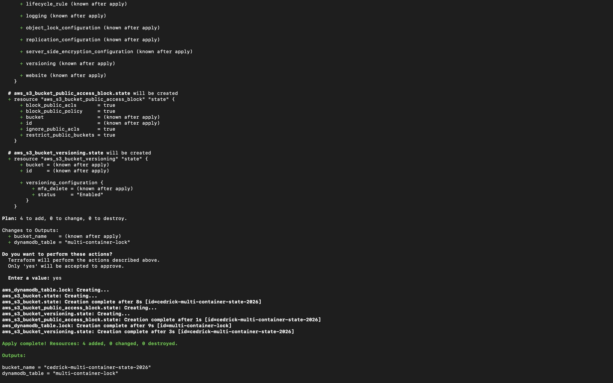

---

### Stage 2 — Deploy EC2 Infrastructure

```bash
cd ../../terra-modules
terraform init
```

Downloads the AWS + local providers and connects to the S3 remote backend.

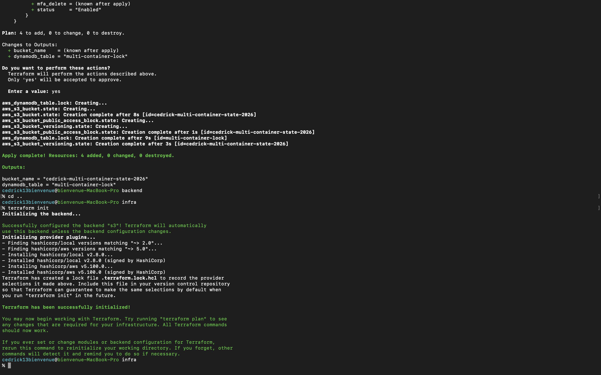

```bash
terraform fmt
terraform validate
```

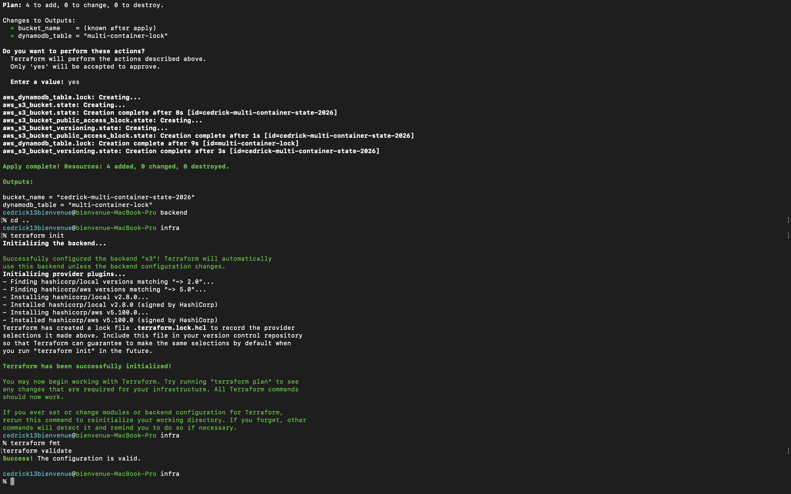

```bash
terraform apply -var="my_ip=$(curl -s https://checkip.amazonaws.com)/32"
```

Calls the `vpc`, `security-group`, and `ec2` modules in order — creates VPC, subnet, IGW, route table, security group, key pair, and EC2 instance. Also writes `inventory.ini` automatically into `infra/ansible/`.

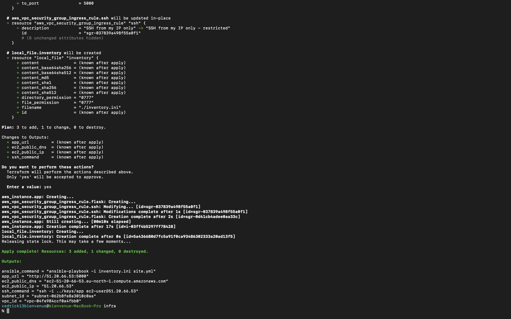

---

### Stage 3 — Configure the Instance with Ansible

Wait ~30 seconds for EC2 to finish booting, then:

```bash
cd ../ansible
ansible-playbook -i inventory.ini site.yml
```

Ansible connects over SSH and installs Docker, Docker Compose v2.29.1, and Git. All tasks run without `sudo docker` requirement — `ec2-user` is added to the docker group.

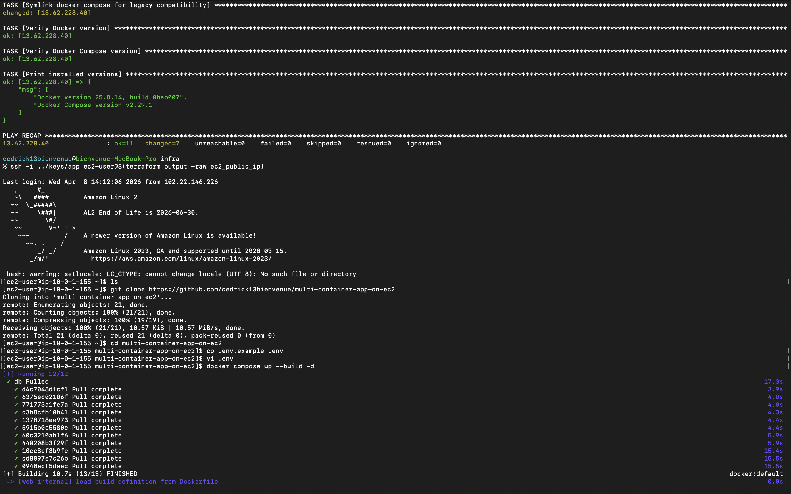

---

### Stage 4 — Run Locally First (Verify Before EC2)

Before deploying to EC2, verify the app works on your local machine:

```bash
cd ..   # back to project root
docker compose up --build -d
docker compose ps
```

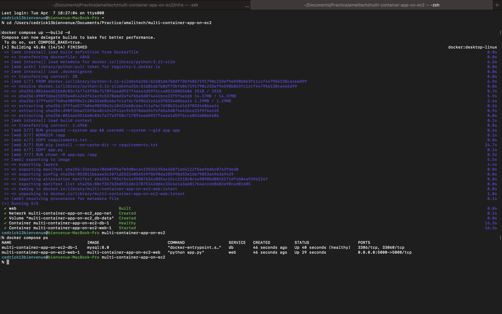

```bash
curl http://localhost:5000
curl http://localhost:5000/health
curl http://localhost:5000/users
curl http://localhost:5000/users/1
```

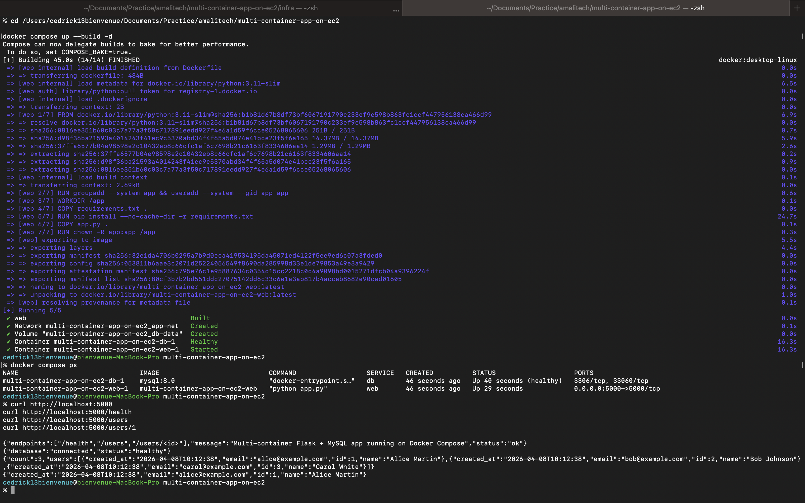

```bash
docker compose logs
```

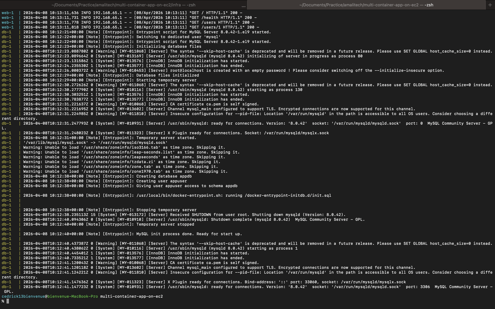

```bash
docker compose down --volumes
```

---

### Stage 5 — Deploy on EC2

```bash
cd infra/terra-modules
ssh -i ../../keys/app ec2-user@$(terraform output -raw ec2_public_ip)
```

Inside EC2:

```bash
git clone https://github.com/cedrick13bienvenue/multi-container-app-on-ec2
cd multi-container-app-on-ec2
cp .env.example .env
nano .env    # fill in real passwords
docker compose up --build -d
```

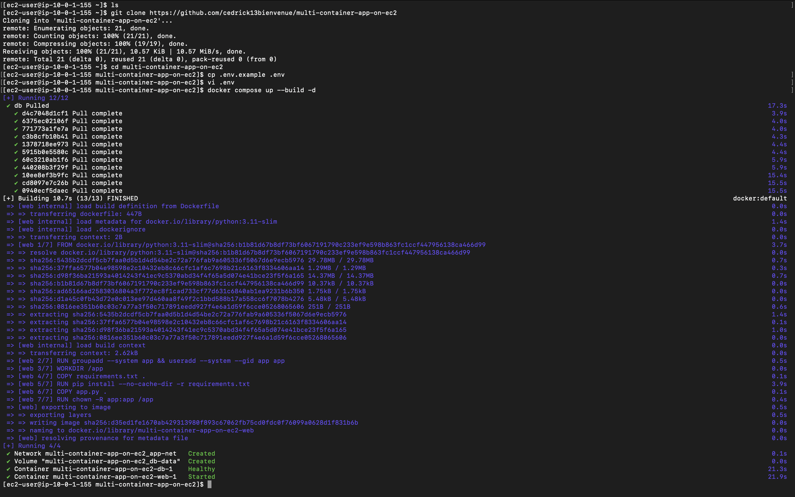

```bash
docker compose ps
```

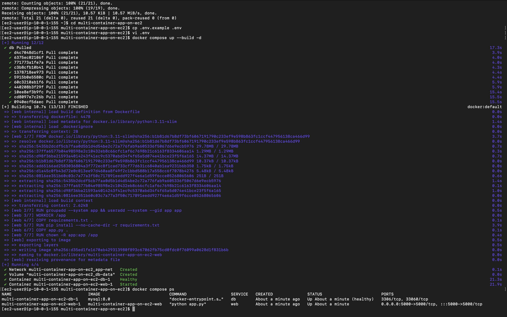

```bash
curl http://localhost:5000
curl http://localhost:5000/health
curl http://localhost:5000/users
curl http://localhost:5000/users/1
docker compose logs
```

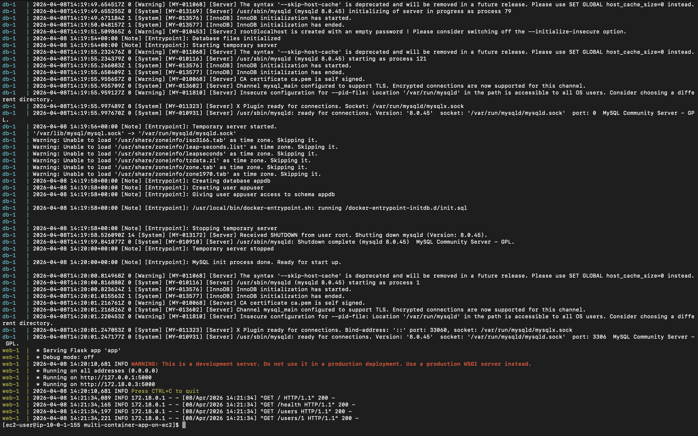

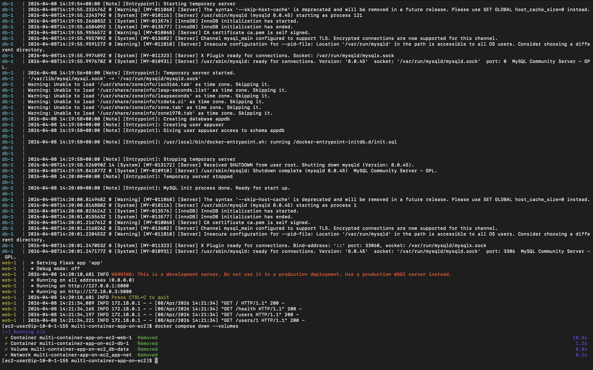

You can also hit the API directly from the browser using the EC2 public IP:

```
http://<ec2_public_ip>:5000/users
```

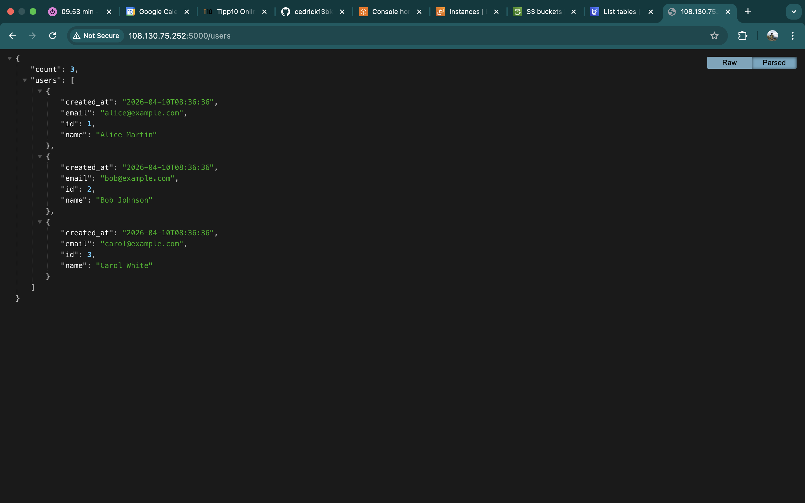

---

### Stage 6 — Teardown

```bash
# On EC2
docker compose down --volumes
exit

# On local machine — destroy EC2 infrastructure
cd infra/terra-modules
terraform destroy -var="my_ip=$(curl -s https://checkip.amazonaws.com)/32"

# Destroy the backend last
cd ../backend
terraform destroy
```

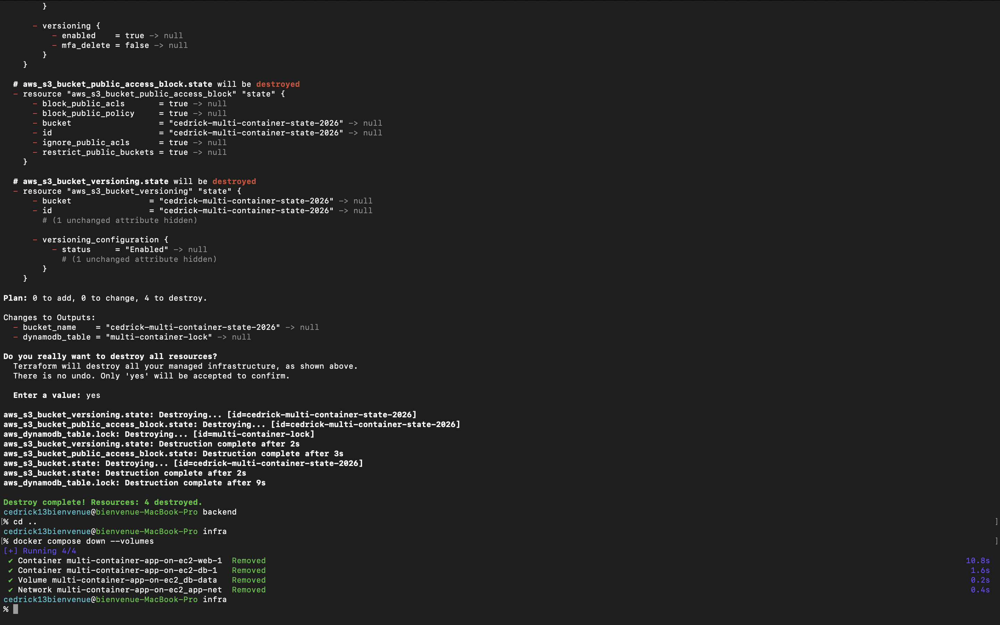

> **Order matters** — always destroy main infra before the backend. Destroying the backend first removes the state file and Terraform loses track of what to destroy.

---

## Resources Deployed

| Resource         | Name                              | Details                              |
|------------------|-----------------------------------|--------------------------------------|
| VPC              | multi-container-app-vpc           | CIDR: 10.0.0.0/16, DNS hostnames on  |
| Public Subnet    | multi-container-app-public-subnet | CIDR: 10.0.1.0/24, eu-west-1a        |
| Internet Gateway | multi-container-app-igw           | Attached to VPC                      |
| Route Table      | multi-container-app-public-rt     | Route: 0.0.0.0/0 → IGW               |
| Security Group   | multi-container-app-sg            | SSH (22) from my IP, Flask (5000)    |
| Key Pair         | multi-container-app-key           | Ed25519, registered from local key   |
| EC2 Instance     | multi-container-app-ec2           | t3.micro, Amazon Linux 2             |

---

## Remote Backend

| Component      | Name                              | Purpose                            |
|----------------|-----------------------------------|------------------------------------|
| S3 Bucket      | cedrick-multi-container-state-2026 | Stores terraform.tfstate file     |
| DynamoDB Table | multi-container-lock              | State locking (prevents conflicts) |

State file path in S3: `multi-container-app/terraform.tfstate`


---

## Key Design Decisions

**Health check gates startup** — `depends_on: condition: service_healthy` ensures Flask never attempts a DB connection before MySQL has finished initializing. Without this, the app crashes on first start and requires a manual restart.

**Ansible over user_data** — `user_data` runs blind: no live output, can't be re-run, can't tell which step failed. Ansible gives task-by-task output, idempotency, and can be re-run at any time against any instance.

**Inventory auto-generated by Terraform** — the `local_file` resource writes `inventory.ini` with the real EC2 IP after `terraform apply`. No manual copy-pasting of IPs between tools.

**Docker Compose v2.29.1 pinned** — Compose v5+ requires Docker Buildx, which is not bundled with Docker 25 on Amazon Linux 2. v2.29.1 uses the legacy builder with no external dependency.

**Named internal network** — the `db` service is not published on the host. MySQL is only reachable by service name (`db`) from within `app-net` — not from the internet or other Docker projects on the same host.

**Terraform modules** — infrastructure is split into three reusable modules (`vpc`, `security-group`, `ec2`). Each module owns its own resources, variables, and outputs. The root module (`terra-modules/main.tf`) wires them together by passing outputs from one module as inputs to the next — e.g. `module.vpc.subnet_id` feeds directly into `module.ec2.subnet_id`. This makes each component independently testable and reusable across projects.

**Non-root container user** — the Flask image creates a system user `app` and drops to it before the process starts. If the container is compromised, the attacker has no root access to the host filesystem.
